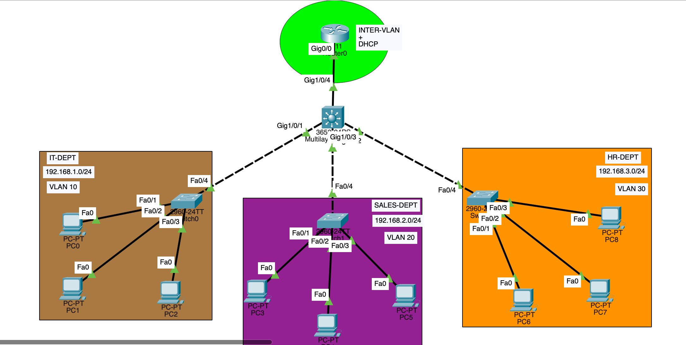

# Inter-VLAN Routing + DHCP (Router-on-a-Stick)

This lab demonstrates **Inter-VLAN routing** using **Router-on-a-Stick** and provides **DHCP** for multiple VLANs from the router.

## What this project covers
- Creating VLANs (IT, SALES, HR)
- Assigning access ports to VLANs on access switches
- Configuring trunk links between access switches and a multilayer switch
- Trunking from the multilayer switch to the router
- Configuring router subinterfaces with 802.1Q encapsulation
- Configuring DHCP pools and excluded addresses per VLAN

---

## Topology

### Topology (definition)
In networking, a **topology** is the layout of a network—how devices (routers, switches, PCs, servers) are connected and how traffic flows between them.

### Diagram

---

## VLANs and Networks
| Department | VLAN | Subnet | Default Gateway |
|---|---:|---|---|
| IT | 10 | 192.168.1.0/24 | 192.168.1.1 |
| SALES | 20 | 192.168.2.0/24 | 192.168.2.1 |
| HR | 30 | 192.168.3.0/24 | 192.168.3.1 |

---

## Files
- **Router config:** `configs/router/R1-router-on-a-stick-dhcp.txt`
- **Multilayer switch config:** `configs/multilayer-switch/MLS1-trunks-vlans.txt`
- **Access switch configs:**
  - `configs/access-switches/SW-IT-vlan10.txt`
  - `configs/access-switches/SW-SALES-vlan20.txt`
  - `configs/access-switches/SW-HR-vlan30.txt`
- **Packet Tracer file:** `packet-tracer/inter-vlan-dhcp.pkt`
- **Docs:** `docs/`

---

## Quick verification
On router:
- `show ip interface brief`
- `show ip dhcp binding`
- `show ip dhcp pool`

On switches:
- `show vlan brief`
- `show interfaces trunk`

---

## Notes
- This design uses a **router** to perform inter-VLAN routing via subinterfaces (802.1Q).
- The multilayer switch is used as a trunk aggregation point (L2 trunking in this lab).

---

## Author
Ankit Kuttarmare
